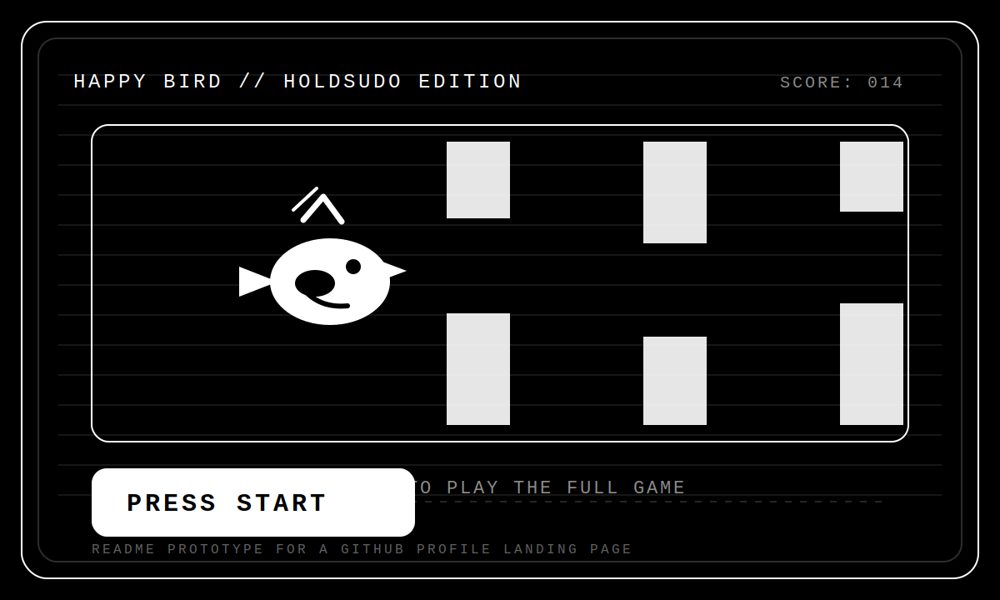

<p align="center">
  
</p>

<p align="center">
  <a href="https://holdsudo.github.io/"></a>
  <a href="#pilot"></a>
  <a href="#loadout"></a>
  <a href="#stages"></a>
  <a href="#final-boss"></a>
</p>

```text
BOOTING HOLDSUDO ARCADE...
MONOCHROME MODE ENABLED
PRESS START
```

This is the direction I would take for your actual GitHub profile `README.md`.

It treats the profile like an arcade cabinet:
- the hero image is the game screen
- the sections feel like levels
- the call to action is the playable site

---

## Pilot

```text
NAME      holdsudo
CLASS     builder / operator / creative technologist
STATUS    airborne
MISSION   ship weird things that still feel clean
```

You are not scrolling through a resume. You are entering a run.

The bird is the avatar.
The pipes are projects, bugs, deploys, experiments, and whatever else is in the way.

---

## Loadout

| Slot | Equipped |
| --- | --- |
| Core | JavaScript / frontend systems / product experiments |
| Utility | automation / scripting / shipping fast |
| Navigation | design taste / interaction / visual polish |
| Recovery | iterate, rebuild, relaunch |

---

## Stages

### Stage 1: Through the repo canopy
- featured projects
- weird experiments
- interfaces worth clicking

### Stage 2: Across the deploy pipes
- shipped work
- current focus
- active builds

### Stage 3: Into the signal vault
- contact
- links
- resume

---

## Final Boss

```text
BOSS NAME   friction
WEAKNESS    good taste + execution
REWARD      one more shipped thing
```

<p>
  <a href="https://github.com/holdsudo"></a>
  <a href="https://www.linkedin.com/in/josephamizrahi"></a>
  <a href="mailto:jmizrahi7@gmail.com"></a>
</p>

<details>
  <summary>unlock developer note</summary>

  The real version of this README would keep this monochrome arcade shell, then point into the actual playable Happy Bird hosted on GitHub Pages.
</details>
